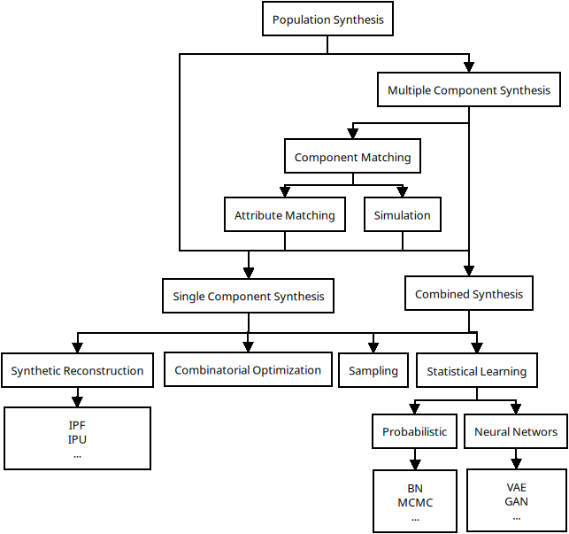

# OpenOPorto
## Generalizable Methodological Framework for Dynamic Synthetic Populations in Portugal  

*Description: TODO*

---

### Before running

#### Setup Python version and venv (Recomended, using pyenv)
```bash
pyenv install 3.12.3 
pyenv local 3.12.3
python -m venv .venv
source .venv/bin/activate
```

#### Check that java and osmium are installed, and their versions
```bash
java --version
osmium --version
``` 

#### Install requirements

```bash
pip install -r requirements.txt
```

---

### Generating a Synthetic Population

The Population Synthesis process follows the Methodological framework examplified in the figure bellow:



To generate a synthetic population the user must decide what components are being generated, and how they are merged to generate the full population. The file `generate_population` shows how it can be done, and is the basis for generating Porto's population with **attributes** and **activities** and connecting them with **Attribute matching**. It also makes use of the `config.py` file, and can be directly used without any change, to generate Porto's population, or serve as a start point to generate other scenarios populations.

The `populationSynthesis` class must implement the `export` method, for that the `external` package provides exporters, currently the MATSim exporter is available and is the one used to export Porto's population as a valid input for the simulation. The `generate_population`script additionally exports the population as a csv.

To run Porto's population synthesis, the needed files should be present in `Population/.data`, to automatically download these files, there is the script `Simulation/loadPortoData.sh`. There is part of the data that is publicly available only under request to the Institute of Statistics, so that is not collected with the script.

Considering that, to run the basic setup and population synthesis for Porto, without modifications, the user can run the following commands.

```bash
cd Simulation
chmod +x loadPortoData.sh
./loadPortoData.sh
cd ../Population
python generate_population.py
```

### Setting up a Simulation


#### Setting up the Physical Network


#### Runnig Porto's Scenario
In the `Simulation` folder there is a file called `loadPortoData.sh` which when run should automatically download the necessary files for the Porto simulation.

However, the travel survey data is not publicly available without requesting it first, so all the other files will be downloaded, expcept for those.

The config files for both *Population* and *Physical Network* are set up to Porto in this repository, so the rest should be the same as running other scenarios

#### Running any simulation
The `Simulation` folder provides shell scripts to help preparing the input for a MATSim simulation. Running the `setup.sh` script will copy the files from `Population` and `PhysicallNetwork`, or run the scripts that create them if they do not exist. Additionally it downloads MATSim if not found.

The script `setup.sh` accepts two positional arguments: 

- `clear`: Deletes the `input` and `output` folders before the setup 
- `run`: Runs the simulation after the setup.

Another script: `run.sh` is also provided, that just calls MATSim and starts the simulation, it can be provided an argument with the size of the java stack, as it is often needed.

### Tested versions
- Python 3.12.3
- Java openjdk 17.0.17 (build 17.0.17+10-Ubuntu-124.04)
- pt2matsim 24.4
- osmium 1.16.0 (libosmium 2.20.0)
